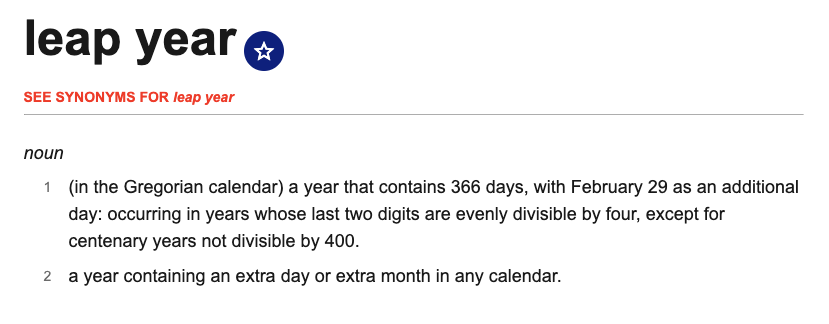
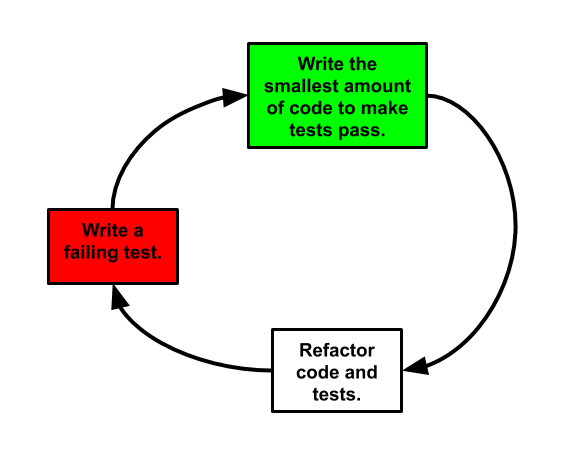

```{r setup, include=FALSE}
knitr::opts_chunk$set(echo = TRUE, fig.align = 'center')
```
# Learning Objectives<br>

* Know what unit testing is
* Know why unit testing is helpful
* Be able to write simple tests using the `testthat` package

**Duration - 45 minutes**

<br>
<hr>

# Why test?

**Reproducibility** in data analysis is very important! Ideally, we would be able to take an analysis project we completed some time ago, quickly understand the analysis we performed, and re-run the analysis on the data yielding the **same** results as we got previously.

The main benefit of R (and Python) over environments like SPSS and Excel is that we can code our own analysis routines if we don't find existing base functionality or a package that does what we need. This means we can write functions to do what we want. But this flings up it's own problems. Right now, your process of writing your own functions probably looks something like this: 

  - Write a function and load it up.   
  - Try it out in the console and see if it works. 
  - Be happy that you wrote a function that works and move on with your life. 

While you are in a way testing your code and it's reproducibility by doing this, you’re only doing it informally. The problem with this approach is that when you come back to this code in 3 months time to add a new feature, you’ve probably forgotten some of the informal tests you ran the first time around. This makes it very easy to break code that used to work. It is also likely that we will continually adapt our analysis routines to new problems and uses. So the question naturally arises:

<br><br>
<center>How do we know that our code will yield **consistent** results over time?</center>
<br><br>


The short answer is, we don't. In order to be sure of this, it requires that we **test our code**. Testing code can be painful and tedious, but it greatly increases the quality of your code. It also ensures that your code does what you want it to do in many situations. This lesson will introduce you to a concept called **testing**, and show you how to do it effectively. 


<br>
<hr>

# Unit testing

**Unit testing** is just a fancy way of saying 'test small bits of code'. In R, these will be individual functions. Unit testing involves writing some code (called **tests**, or a **suite of tests**) to test your functions are working properly.


<br> 

```{r, echo=FALSE, out.width = '50%'}
knitr::include_graphics("./images/unit_testing.jpg")
```

<br>


Yes... we are telling you that. In order to understand tests, it's best to see unit testing in action. 

<br>
<hr>

## Unit test specifications


The first thing we need to do is adjust our mental model of coding slightly: 

* Beforehand, with no testing, we had a 'loose' specification of what a piece of code does, perhaps backed up by some quick tests we ran in the console so we could be fairly confident it worked.
* Now, with a test suite, we have a 'tight' specification. Think of a piece of code as doing **exactly what the tests specify it does**: no more, no less. We rely upon functionality specified by the tests!

Let's be a bit more specific. Imagine an R function `is_leap_year()` which takes a year and returns `TRUE` if the number is a leap year and `FALSE` otherwise.

The **loose** specification will be the definition of a leap year (which you can just find on google): 

<br> 

```{r, echo=FALSE, out.width = '60%'}

```
<br> 


The **tight** specification in the test suite corresponds to **a set of inputs and required outputs**:

| Situation          | Example Input | Example Output |
|--------------------|---------------|----------------|
| Normal leap year   | `2020`        | `TRUE`         |
| Non-leap year      | `2019`        | `FALSE`        |
| Divisible by 400   | `1900`        | `FALSE`        |
| Divisible by 100   | `2000`        | `TRUE`         |
| Not a number       | "year"        | An error       |

In the future, we rely on functionality proven by the current test suite. Any time we change our analysis routines we **re-run the tests and debug as necessary**: this makes sure that the behaviour of the code is consistent over time!

<br>
<hr>


## Creating a function to test 

Let's write a first attempt at the `is_leap_year()` function to begin with, as we need a function to test.   

```{r}
is_leap_year <- function(year){
  
  if (year %% 100 == 0){
    if (year %% 400 == 0){
      return(TRUE)
    } else{
      return(FALSE)
    }
  } 
    
  if (year %% 4 == 0){
    return(TRUE)
  } else {
    return(FALSE)
  }
  
}
```


<blockquote class = 'task'>

**Task - 5 minutes**

Write out what this function is doing, and why it is written in this format (e.g. Why do we test the 100 and 400 years first?)

<details>
<summary>**Solution**</summary>

This function is doing the following:

- Taking in a vector `year`  
- Checks to see if that year is divisible by 100  
- Checks to see if that year (that is divisible by 100) is also divisible by 400  
- If it is divisible by both, it will return `TRUE`  
- If it is not divisible by both, it will return `FALSE`  
- It then moves on to check if the year is divisible by 4  
- If it is, then it will return `TRUE`  
- If it is not, then it will return `FALSE`  

We have to write the logic this way, because if it just checked if it was divisible by 4 first, then all years (those divisible by 100 and 400) would get marked as `TRUE`. The way we have written it means that we can catch those 100/400 years first, and then move on to the rest.  

</details>
</blockquote>


Neat! Now we have a function, let's perform unit testing. 


<br>
<hr>

## The `testthat` package

As usual, there is a package in R to do what we need to do. The authors of the `testthat` package describe it as:

> testthat tries to make testing as fun as possible, so that you get a visceral satisfaction from writing tests. Testing should be addictive, so you do it all the time. 

```{r, warning=FALSE, message=FALSE}
library(testthat)
```

We will look at two useful functions from this package:

  * `expect_equal` : checks that the objects gives you an answer (or value) you expect.  
  * `expect_error` : check that code throws an error.   


For example, let's say we have the following variable:

```{r}
a <- 10
```

What are we expecting a to return? In this case, `10`. We can test that this is true, by using these two functions from the `testthat` package. 

```{r}
# we expect the variable a, to equal 10. If it does, carry on, no error. 
expect_equal(a, 10)
```

Great, this works. Now let's try it with a number we know doesn't equal our variable `a`. In this case, we'd expect an error. 

```{r, error=TRUE}
# we know that a doesn't equal 11, so we expect an error.
expect_equal(a, 11)
```

This hopefully describes the basics of testing for now. To see it in action, let's test our `is_leap_year` function. 

<br>

### Tests that pass 

We've already come up with a series of inputs and expected outputs above. 

<br>

The **tight** specification in the test suite corresponds to **a set of inputs and required outputs**:

| Situation          | Example Input | Example Output |
|--------------------|---------------|----------------|
| Normal leap year   | `2020`        | `TRUE`         |
| Non-leap year      | `2019`        | `FALSE`        |
| Divisible by 400   | `1900`        | `FALSE`        |
| Divisible by 100   | `2000`        | `TRUE`         |
| Not a number       | "year"        | An error       |

<br>

The workflow of unit testing is best described by example. Let's write a test that checks if real leap years return a true value from our function. 

```{r}
# first test: two expectations
test_that("Real leap years return true", {
  expect_equal(is_leap_year(2020), TRUE)
  expect_equal(is_leap_year(2000), TRUE)
})
```


Let's break down a unit test. The `testthat` package implements unit tests in a hierarchy:

* The `test_that` function creates a test. The test name is the first string you put into the function (in this case, `"Real leap years return true"). Giving it a name helps to track down failing tests. 

* The lowest level of the hierarchy is the **expectation**, which can either be `TRUE` or `FALSE`. A **test** will contain **expectations**. An expectation describes the expected result of the computation. For example, in our example above we see an expectation in the call to `expect_equal` function. You can read this almost literally... We expect the year 2020 to return a `TRUE` value, because it is a true leap year. 

* The next level up is the **test**. This is the whole chunk... it contains **one or more expectations**. The first test above contains two expectations. 

* Next up, we typically gather tests together in a **file**.  

* When writing code, you should keep your files filled with tests in a directory and periodically run those tests using `test_dir`. 


And that's our first test done! 


<br>

<blockquote class = 'task'>

**Task - 5 minutes**

Take the following test code and write down an explanation of all the different parts:

  * What is the test name?
  * What is the expectation?
  * What are you expecting this test to do?
  
Think carefully about the logic of this one before you write down your assumptions... you may want to try and run it to see what happens first.   

```{r}
# second test : one expectation
test_that("Character input returns an error", {
  expect_error(is_leap_year("year"))
})
```


<details>
<summary>**Solution**</summary>

* Test name: `"Character input returns an error"`
* Expectation: `That we expect an error when characters are put into our function`  
* What will this test do: `This test will expect an error in the leap year function if you put text in. But because we expect an error, we actually don't want this *test* to throw an error.`

This one is quite tricky, because it's looking for no errors, when checking for an error. You'd be expecting `is_leap_year()` to throw an error if text gets entered, but `expect_error` should not. 


</details>
</blockquote>


<br> 

### Tests that fail 

Great. Now let's look at an example of tests that fail. If you run the code below, you'll see the errors. 


```{r, error = TRUE}
test_that("Non-numeric input returns an error", {
  expect_error(is_leap_year("year"))
  expect_error(is_leap_year(TRUE))
})
```


<blockquote class = 'task'>

**Task - 5 minutes**

* Which of our tests has failed?  
* Why has it failed?   
* Why has our other test passed?  

<details>
<summary>**Solution**</summary>

* Our second `expect_error` test has failed. 
* Our second test failed because it is expecting an error when we put the word `TRUE` into our `is_leap_year()` function, but we don't get an error.   
* Our first test has passed because it is expecting an error when we put the character string `"year"` into our function, and we do get an error.  

</details>
</blockquote>


So now let's change the function code to make this test pass:

```{r}
is_leap_year <- function(year){

  # add a condition, that makes sure our function ONLY takes in numeric input
  if (!is.numeric(year)){
    stop("Non-numeric input 😿")
  }
    
  if (year %% 100 == 0){
    if (year %% 400 == 0){
      return(TRUE)
    } else{
      return(FALSE)
    }
  } 
    
  if (year %% 4 == 0){
    return(TRUE)
  } else {
    return(FALSE)
  }
  
}
```

<br>

Now our function has been updated so that the first thing it will do is check for non-numeric input. That should allow our test to work now: 

<br>


```{r}
test_that("Non-numeric input returns an error", {
  expect_error(is_leap_year("year"))
  expect_error(is_leap_year(TRUE))
})
```

Yay, no errors in our test! Which is what we want, because since we want to test and see if we get an error, if our function throws an error but our test doesn't, that means it's done what we want. 

<br> 


<blockquote class = 'task'>

**Task - 5 minutes**

Write a test that checks whether `2017` and `1900` are correctly identified as not being leap years by our `is_leap_year()` function. 

<details>
<summary>**Solution**</summary>

```{r}
test_that("Non leap years return false", {
  expect_equal(is_leap_year(2019), FALSE)
  expect_equal(is_leap_year(1900), FALSE)
})
```

</details>
</blockquote>

<br>
<hr>


# When should you use testing?

This is a difficult question to answer in general, but there are some broad principles that apply:

* If you find yourself writing numerous 'informal' tests in the console: feeding known inputs to a function and checking the output, you should formalise this process into a set of unit tests.
  - you lose nothing by writing unit tests, and you can *use the tests again* at little cost!
  - the tests act as a specification for yourself and others of *how your function* is expected to behave.
  - they encourage you to re-use functions with confidence

* If you find yourself writing a 'tricky' function with many edge cases and/or error handling, you would probably find unit testing helpful.

* If you ever get involved in *writing* new data analysis packages, you should certainly use unit tests!

* For day-to-day data wrangling via well-established R packages, there is probably little need to deploy unit tests. 


# Other expectations - Optional

So far we've seen the `expect_equal()` and `expect_error()` expectations: these will be the mainstays of unit testing, but `testthat` offers a number of other options that are more or less useful. A few of these are listed below.  


```{r}
# expect_type checks the class of an object
expect_type("hello", "character")
```


```{r}
# test for two objects being *exactly* equal
num1 <- 5
num2 <- (sqrt(5))^2

expect_equal(num1, num2)
# this will fail
#expect_identical(num1, num2)
```

```{r}
# there are >, >=, <, <= type expectations too, 
# e.g. expect greater than
expect_gt(5, 3)
```

```{r}
# and pattern matching with various options, see grepl() docs for details
string <- "Is there a match?"
expect_match(string, "there a")
expect_match(string, "iS ThErE", ignore.case = TRUE)
```

# Test-driven development - Optional  

We've just performed a simple example of process known in software development as **test-driven development** (also known as the **"red-green-refactor" cycle**). The following diagram shows how we develop new code functionality using TDD.

```{r, echo=FALSE, fig.cap='**Fig. 2** Test-driven development, or the "red, green, refactor" cycle', out.width = '60%'}

```

The main benefits of TDD are:

* Writing tests first forces you to consider carefully what you want a function to do, so you are more likely to develop small, efficient functions.
* You avoid 'premature optimisation': the code has the minimum functionality necessary to make tests pass, rather than becoming stuffed with features that may never be used.
* You don't spend time devising or reinventing informal tests as code develops. Instead, you have one test suite that grows with the code.
* The tests are a **detailed specification** of what the code does. This helps you and others understand the code when you return to it after time away. It also helps when writing code that depends on the tested code, as its behaviour is well specified.
* The code is more likely to remain consistent or 'backwards compatible' as it develops: we never decrease the **coverage** of tests as we develop. 


# Recap

<br>

* What is unit testing?
<details>
<summary>**Answer**</summary>
Unit testing is the process of taking a small 'unit' of code (a *function* in our case in R), and checking that it returns a set of expected outputs (or expected errors) for each of a set of specified inputs.
</details>

<br>

* Why is unit testing useful in data analysis?
<details>
<summary>**Answer**</summary>
It:
  - makes analysis code more robust, and consistent over time
  - encourages re-use of code
  - discourages wasteful informal testing in the console (which may have to be 'reinvented' multiple times as code is further developed in the future)
  - provides a detailed specification of precisely how your function is expected to behave, helping other analysts and your future self understand your code
</details>

<br>

* What hierarchy of testing does the `testthat` package use?
<details>
<summary>**Answer**</summary>
'expectations' reside within 'tests', which in turn reside within 'files' (previously known as 'contexts').
</details>

<br>

* What expectation function would we use to check that the expected and actual outputs of a function match?
<details>
<summary>**Answer**</summary>
`expect_equal()`
</details>

<br>

* What expectation function would we use to check that a function call raises an error?
<details>
<summary>**Answer**</summary>
`expect_error()`
</details>

<br>

* What expectation function would we use to check that a function call returns an object of a particular type?
<details>
<summary>**Answer**</summary>
`expect_type()`
</details>

<hr>

# Additional Resources

Links of where else to look

* [Hadley Wickham's `testthat` intro](https://journal.r-project.org/archive/2011/RJ-2011-002/RJ-2011-002.pdf) 


